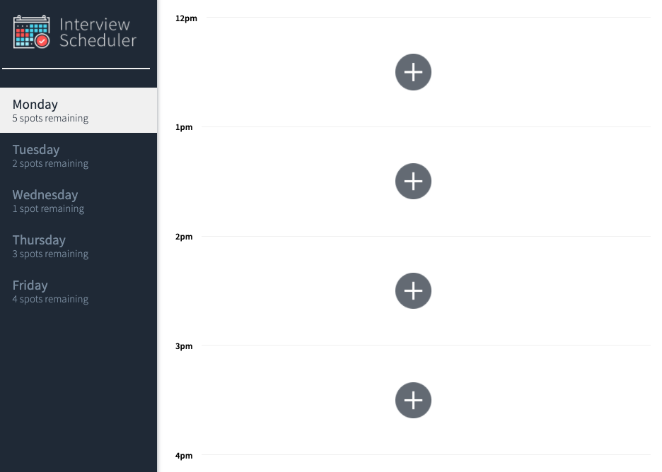
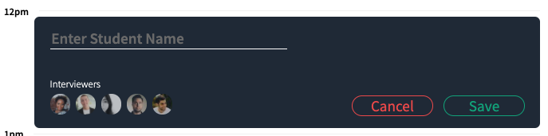
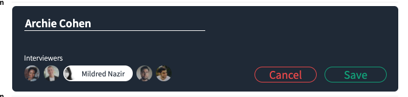
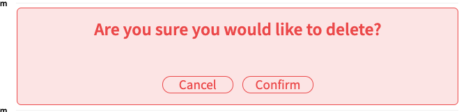
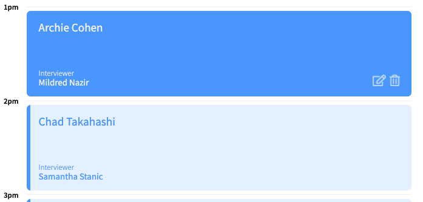

# Interview Scheduler

## Setup

Install dependencies with `npm install`.
Must run both the Webpack development server and [scheduler-api](https://github.com/jjung219/scheduler-api) for the app to run.

## Running Webpack Development Server

```sh
npm start
```

## Running Jest Test Framework

```sh
npm test
```

## Running Storybook Visual Testbed

```sh
npm run storybook
```

## App Screenshots

Landing Page


Adding an appointment


Editing an appointment


Deleting an appointment


Booked appointments
